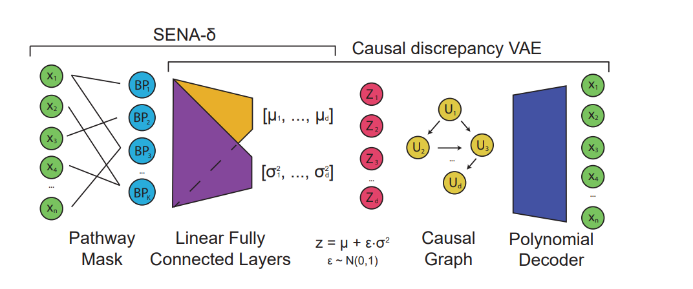

# SENA-discrepancy-VAE

## Overview

SENA-discrepancy-VAE is a **Causal Representation Learning (CRL)** model designed to predict the impact of genomic and drug perturbations on cellular function by mapping biological processes to latent causal factors. The model improves interpretability by leveraging biological processes (BPs) as prior knowledge, allowing the prediction of unseen perturbations while inferring biologically meaningful causal factors. This method extends the discrepancy-vae (https://github.com/uhlerlab/discrepancy_vae).




## Abstract 

<div style="text-align: justify;">
Predicting the impact of genomic and drug perturbations in cellular function is
crucial for understanding gene functions and drug effects, ultimately leading to
improved therapies. To this end, Causal Representation Learning (CRL) constitutes
one of the most promising approaches, as it aims to identify the latent factors
that causally govern biological systems, thus facilitating the prediction of the
effect of unseen perturbations. Yet, current CRL methods fail in reconciling
their principled latent representations with known biological processes, leading
to models that are not interpretable. To address this major issue, in this work
we present SENA-discrepancy-VAE, a model based on the recently proposed
CRL method discrepancy-VAE, that produces representations where each latent
factor can be interpreted as the (linear) combination of the activity of a (learned)
set of biological processes. To this extent, we present an encoder, SENA-δ, that
efficiently compute and map biological processes’ activity levels to the latent causal
factors. We show that SENA-discrepancy-VAE achieves predictive performances
on unseen combinations of interventions that are comparable with its original, noninterpretable 
counterpart, while inferring causal latent factors that are biologically meaningful.
</div>


### Key Features
- **Interpretability:** Latent factors represent a linear combination of biological processes' activity levels.
- **Prediction of unseen perturbations:** Comparable performance to non-interpretable models.
- **Integration of prior biological knowledge**: Employs biological processes (BPs) as prior knowledge to map causal factors.

## Architecture

The SENA-discrepancy-VAE modifies the encoder architecture of the standard discrepancy-VAE by introducing a **SENA-δ encoder**. This encoder is biologically driven, incorporating BPs as masks that guide the mapping from gene expressions to causal factors.

- **SENA Layer:** Summarizes gene expression data to infer BP activity levels.
- **Two-Layer Encoder:** The second layer combines BP activity levels to produce latent factors used in the VAE framework.

For more details on the architecture and methodology, refer to our paper.

## Usage

1. Clone the repository:
    ```bash
    git clone https://github.com/ML4BM-Lab/SENA
    ```

2. The model has been evaluated on a large-scale **Perturb-seq** dataset, 
which profiles gene expression changes in leukemia cells under genetic perturbations.
We use the preprocessed version by CPA (https://github.com/facebookresearch/CPA), which 
we provide in the data folder as a zip file.:

    ```bash
    wget https://dl.fbaipublicfiles.com/dlp/cpa_binaries.tar
    tar -xvf cpa_binaries.tar
    cp Norman2019_raw.h5ad data/.
    rm cpa_binaries.tar
    ```

    Alternatively, we have generated a reduced version of this dataset, which you can find as a .zip file in the data folder.
    This will be the datased used by default.

    ```bash
    #this will generate a Norman2019_reduced.h5ad file
    unzip Norman2019_reduced.zip
    ```

3. This project runs in a docker container. Run this code to build the image and to run the container

    ```bash
    # build the image
    docker build -t <image_name> .

    # run creating a virtual link to your SENA folder.
    docker run -dt -v <your_path>/SENA:/wdir/ --gpus all --name <container_name> <image_name>

    # access the docker (we will assume its called sena_vae)
    docker exec -it sena_vae bash
    ```

4. The metrics are reported in a local mlflow server. To run it: 

    ```bash
    # assuming you are placed within the SENA folder and port 5678 is unused
    docker run -dt -p 0.0.0.0:5678 -v .:/wdir/ --gpus all --name <container_name> <image_name>

    # access the docker on a second terminal
    docker exec -it sena_vae bash

    # start the server
    mlflow ui --host 0.0.0.0 --port 5678
    ```

5. Now you can run SENA-discrepancy-VAE by doing: 

    ```bash
    python3 src/sena_discrepancy_vae/main.py
    ```

6. Finally, you can retrieve the metrics of the trained model:

    ```bash
    # You can choose the folds to evaluate. (e.g. only double)
    python3 src/sena_discrepancy_vae/inference.py --savedir results/example --evaluation_types train test double
    ```


### Configuration options

The script accepts several command-line arguments to customize the training process. Below is a detailed list of all available parameters:

### General Parameters

- `-s`, `--savedir` (str): Directory to save the results. Default: `'./results/'`. (folder will be created automatically)
- `--device` (str): Device to run the training on (cpu or cuda). Default: `'cuda:0'`.
- `--model` (str): Model to use for training, either `'sena'` or `'original'`  Default: `'sena'`.
-  `--dataset` (str): Name of the dataset used. Default: `'Norman2019_reduced'`.
- `--name` (str): Name of the run, used for organizing output files. Default: `'example'`.
- `--log` (bool): Whether to use a local mlflow server to visualize training. Default: False.
- `--seed` (int): Random seed for reproducibility. Default: `42`.

### Training Parameters

- `--epochs` (int): Number of training epochs. Default: `100`.
- `--batch_size` (int): Batch size for training. Default is set within the script (`32`), but can be modified.
- `--lr` (float): Learning rate. Default is set within the script (`1e-3`), but can be modified.
- `--sena_lambda` (float): Sena λ value. Default: `0`.
- `--latdim` (int): Latent dimension size. Default: `105`. (equal to the number of perturbations/knockout types)
- `--lr` (float): Learning rate. Default is set within the script (`1e-3`), but can be modified.
- `--grad_clip` (bool): Whether to apply gradient clipping during training. Default is `False`.

### Advanced Model Parameters

These parameters are set within the script but can be modified for advanced configurations:

- `mxAlpha` (float): Hyperparameter alpha for the model. Default: `1.0`.
- `mxBeta` (float): Hyperparameter beta for the model. Default: `1.0`.
- `mxTemp` (float): Hyperparameter temperature for the model. Default: `100.0`.
- `lmbda` (float): Regularization parameter lambda. Default: `0.1`.
- `MMD_sigma` (float): Sigma value for the Maximum Mean Discrepancy (MMD) kernel. Default: `200.0`.
- `kernel_num` (int): Number of kernels for MMD computation. Default: `10`.
- `matched_IO` (bool): Whether to use matched input/output pairs. Default: `False`.
- `--grad_clip` (bool): Whether to apply gradient clipping during training. Default is `False`.

## License

This project is licensed under the MIT License. See the [LICENSE](LICENSE) file for more details.

## Cite
